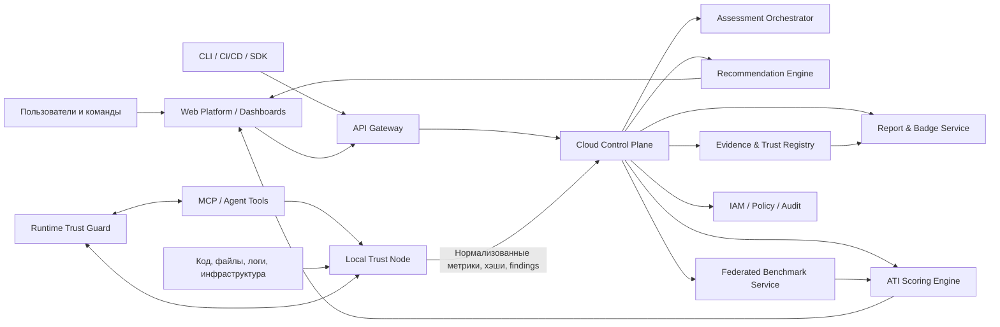
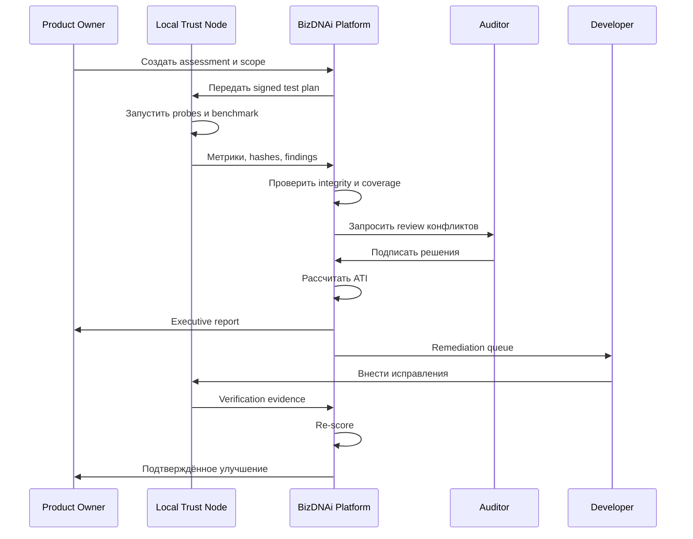

# BizDNAi AI Trust Platform  
## Product Specification v1.0

**Статус:** Baseline Product Specification  
**Дата:** 25 июля 2026 года  
**Владелец продукта:** BizDNAi  
**Основатель и Product Owner:** Рашид Кабжанов  
**Класс документа:** Конфиденциальная рабочая спецификация  
**Язык документа:** русский  
**Целевая аудитория:** Product, Engineering, Security, Data, DevOps, QA, UX, Sales Engineering, партнёры и инвесторы

---

## Управление документом

| Поле | Значение |
|---|---|
| Версия | 1.0 |
| Назначение | Зафиксировать целевую продуктовую и техническую архитектуру BizDNAi AI Trust Platform |
| Горизонт | MVP → Production v1 → масштабируемая глобальная платформа |
| Основной продуктовый тезис | Доверие к ИИ и программным продуктам должно измеряться, подтверждаться доказательствами и улучшаться непрерывно |
| Основной индекс | AI Trust Index, 0–10 |
| Связанный индекс | ValIQ, 0–1000 |
| Архитектурный принцип | Local-first, privacy-first, evidence-based |
| Статус оценки | Метрика доверия и готовности, а не государственная или юридическая сертификация |

### История версий

| Версия | Дата | Изменения |
|---|---|---|
| 0.x | июнь–июль 2026 | Формирование продуктовой концепции, архитектуры и рыночного позиционирования |
| 1.0 | 25.07.2026 | Первая цельная спецификация платформы, модулей, данных, API, scoring, безопасности и roadmap |

---

# 1. Резюме продукта

BizDNAi AI Trust Platform — независимая инфраструктура измерения, проверки и управления доверием к ИИ-агентам, программным продуктам, коду, архитектуре, инфраструктуре и работе с данными.

Платформа создаётся для новой среды, в которой ИИ уже не только отвечает на вопросы, но и действует: читает документы, открывает сайты, вызывает API, работает с CRM и ERP, использует браузер, выполняет команды, формирует документы, отправляет сообщения, управляет бизнес-процессами и получает доступ к локальным или облачным данным. Обычные средства защиты контролируют сеть, устройства, известные уязвимости и вредоносный код, но не всегда понимают намерение агента, обоснованность его действия, допустимость передачи данных и реальный уровень доверия к системе в целом.

BizDNAi решает эту задачу через семь взаимосвязанных контуров:

1. **AI Agent Benchmarking** — воспроизводимые тесты поведения ИИ-агентов в контролируемых сценариях.
2. **Verified Metrics** — доказуемые метрики с указанием источника, свежести, метода проверки и уровня уверенности.
3. **AI Trust Index** — объяснимый интегральный индекс доверия от 0 до 10.
4. **Federated Anonymous Metrics Network** — распределённая сеть обезличенных статистических метрик для отраслевых сравнений без передачи клиентского кода и данных.
5. **Recommendation Engine** — механизм приоритизации исправлений и повышения индекса.
6. **Runtime Trust Guard** — контроль и при необходимости блокировка опасных действий ИИ-агентов, MCP-серверов, инструментов и автоматизаций.
7. **Executive и Developer Dashboards** — разные представления одной доказательной базы для руководителей, инженеров, аудиторов и партнёров.

Платформа не заменяет антивирус, EDR, SAST, SIEM, firewall, IAM или ручной аудит. Она объединяет их сигналы с собственными проверками и добавляет независимый слой ответа на три вопроса:

- **Можно ли доверять этой системе сейчас?**
- **На основании каких доказательств сделан вывод?**
- **Что необходимо исправить в первую очередь, чтобы доверие выросло?**

Целевой результат использования платформы — не разовый отчёт, а измеримый цикл:

> Baseline assessment → доказательства → AI Trust Index → приоритетные исправления → повторная проверка → подтверждённое улучшение → постоянный мониторинг.

---

# 2. Видение и позиционирование

## 2.1. Видение

Сформировать глобальный, независимый и понятный стандарт доверия к ИИ и цифровым продуктам, при котором разработчик, компания, пользователь, инвестор или покупатель может получить не рекламное заявление поставщика, а измеримую оценку с доказательствами.

## 2.2. Категория продукта

**Independent AI & IT Trust Infrastructure** — независимая инфраструктура доверия, рисков, проверки и оценки цифровых продуктов.

Категория шире, чем AI Security, потому что доверие зависит не только от технических уязвимостей. Оно включает:

- безопасность кода и цепочки поставки;
- архитектуру и инфраструктуру;
- поведение ИИ-агентов;
- доступ к инструментам, данным и секретам;
- качество управления рисками;
- прозрачность и документированность;
- human oversight;
- журналирование и расследуемость;
- соответствие внутренним политикам и применимым требованиям;
- качество эксплуатации;
- фактический пользовательский опыт;
- способность команды исправлять риски;
- достоверность заявленных характеристик.

## 2.3. Продуктовая формула

**ATI отвечает:** «Можно ли доверять?»  
**BizDNAi Security отвечает:** «Где риск и как его устранить?»  
**Runtime Trust Guard отвечает:** «Что делает агент прямо сейчас и нужно ли это остановить?»  
**Benchmark Network отвечает:** «Как система выглядит на фоне сопоставимых систем?»  
**ValIQ отвечает:** «Насколько продукт зрелый и как это влияет на его потенциальную ценность?»

## 2.4. Принципы продукта

1. **Evidence over claims.** Заявление без доказательства не считается подтверждённой метрикой.
2. **Local-first.** Чувствительные данные анализируются в среде клиента.
3. **Minimum necessary transmission.** В облако передаётся только минимально необходимая нормализованная информация.
4. **Explainability.** Каждый индекс должен раскрываться до домена, метрики, теста и доказательства.
5. **Reproducibility.** Проверка должна быть повторяемой в сопоставимых условиях.
6. **Versioned methodology.** Методика, веса, тесты и пороги версионируются.
7. **Continuous trust.** Доверие имеет срок актуальности и должно обновляться.
8. **Human control.** Критические решения и исключения должны быть управляемы человеком.
9. **No hidden penalty.** Пользователь видит причину каждого снижения оценки.
10. **Separation of fact and inference.** Наблюдаемое событие, вывод и рекомендация хранятся раздельно.
11. **Independent but integrable.** Платформа сохраняет независимость, но подключается к существующему security stack.
12. **Useful for action.** Результат должен помогать исправлять, покупать, продавать, инвестировать или управлять риском.

---

# 3. Проблема, которую решает платформа

## 3.1. Новая поверхность риска

ИИ-агент может использовать законные полномочия пользователя для нежелательного действия. С точки зрения сети запрос может быть разрешён, с точки зрения операционной системы процесс может быть легитимным, а с точки зрения бизнеса действие может быть недопустимым.

Типовые примеры:

- агент отправляет конфиденциальный фрагмент во внешний сервис;
- агент раскрывает пароль, токен, cookie или персональные данные;
- агент выполняет инструкцию из недоверенного веб-контента;
- MCP-инструмент получает больше прав, чем требуется;
- агент вызывает API с необратимым действием без подтверждения;
- сгенерированный код содержит скрытую уязвимость;
- модель или агент обходит внутреннюю политику;
- логирование не позволяет восстановить цепочку решения;
- vendor заявляет безопасность, но не предоставляет проверяемых доказательств;
- после обновления модели или инструмента прежняя оценка уже неактуальна.

## 3.2. Разрыв между технической и управленческой картиной

Руководитель получает десятки отчётов, но не понимает общий уровень доверия. Разработчик получает тысячи findings, но не понимает, какие пять исправлений сильнее всего повлияют на реальный риск. Инвестор или покупатель продукта не может сопоставить разные компании. Пользователь не видит, какие данные агент может забрать с компьютера.

BizDNAi создаёт единую модель:

- актив;
- риск;
- проверка;
- доказательство;
- метрика;
- индекс;
- рекомендация;
- подтверждение исправления;
- сравнение с benchmark;
- история изменения доверия.

## 3.3. Почему разовой проверки недостаточно

Доверие изменяется после:

- нового релиза;
- смены модели;
- подключения нового MCP-сервера;
- добавления API;
- изменения прав доступа;
- обновления зависимостей;
- переноса инфраструктуры;
- подключения нового поставщика;
- появления новой уязвимости;
- изменения политики;
- инцидента;
- истечения срока доказательств.

Поэтому ATI в v1.0 является не вечным сертификатом, а снимком состояния с датой, областью действия, уровнем покрытия и сроком актуальности.

---

# 4. Цели и границы v1.0

## 4.1. Цели

Product v1.0 должен:

- создавать карточку проверяемого продукта, агента или системы;
- выполнять локальные автоматизированные проверки;
- запускать сценарные benchmark-тесты агентов;
- принимать ручные и интеграционные доказательства;
- нормализовать доказательства в Verified Metrics;
- рассчитывать ATI 0–10;
- показывать индекс, покрытие, уверенность и критические риски раздельно;
- формировать рекомендации с приоритетом и ожидаемым эффектом;
- поддерживать baseline, remediation и re-score;
- предоставлять Executive Dashboard и Developer Dashboard;
- формировать технический и управленческий отчёт;
- публиковать ограниченный публичный профиль по решению владельца;
- принимать обезличенные агрегаты в Federated Metrics Network;
- сравнивать клиента с релевантной когортой;
- интегрироваться через CLI, REST API, webhooks и MCP;
- журналировать все значимые действия;
- поддерживать multi-tenant SaaS и isolated enterprise deployment.

## 4.2. Не является целью v1.0

В первую версию не входят как обязательные:

- полная замена SIEM, EDR, SAST или облачных CNAPP;
- государственная сертификация;
- юридическое заключение о соответствии всем законам мира;
- автоматическое принятие инвестиционного решения;
- универсальная гарантия отсутствия уязвимостей;
- централизованное хранение полного исходного кода клиентов;
- обучение общей модели на клиентском коде без отдельного согласия;
- автономное исправление критических систем без подтверждения человека;
- массовый consumer-антивирус с полным endpoint-функционалом;
- собственная LLM как обязательный компонент;
- поддержка всех возможных agent frameworks в первом релизе.

## 4.3. Определение готовности v1.0

Версия считается готовой, когда платформа способна провести полный цикл минимум для трёх классов объектов:

1. AI/SaaS-продукт с репозиторием и облачной инфраструктурой.
2. ИИ-агент с MCP/tools/API и тестовой средой.
3. Корпоративная внутренняя система или vendor-продукт, где часть доказательств собирается вручную.

---

# 5. Целевые пользователи и роли

## 5.1. Сегменты

### Разработчики и инженерные команды

Задачи:

- проверить human-written и AI-generated код;
- найти опасные зависимости и секреты;
- проверить права агента;
- воспроизвести атаки и негативные сценарии;
- получить понятный список исправлений;
- подтвердить качество перед релизом или enterprise review.

### Стартапы и software vendors

Задачи:

- доказать доверие enterprise-покупателю;
- подготовиться к инвестициям;
- пройти vendor onboarding;
- снизить блокеры продажи;
- получить ATI-профиль и evidence pack;
- демонстрировать улучшение между версиями.

### Корпоративные заказчики

Задачи:

- независимо оценить vendor или внутренний AI-проект;
- видеть портфель рисков;
- сравнивать системы;
- контролировать агентов и автоматизации;
- формировать отчёт руководству;
- отслеживать remediation.

### Обычные пользователи и малый бизнес

Задачи:

- понимать, к каким файлам, паролям и данным имеет доступ агент;
- блокировать нежелательную передачу;
- видеть простую оценку риска;
- получать рекомендации без сложной терминологии.

### Инвесторы, акселераторы и M&A

Задачи:

- получить быстрый технический trust signal;
- увидеть доказательства, а не только презентацию команды;
- сопоставить ATI и ValIQ;
- выявить критические технологические риски до сделки.

## 5.2. Системные роли

| Роль | Назначение |
|---|---|
| Organization Owner | Управление организацией, подпиской, политиками и публикацией |
| Product Owner | Владелец проверяемого продукта и scope |
| Security Lead | Утверждение политик, исключений и критических findings |
| Developer | Просмотр технических результатов и remediation |
| Auditor | Проведение ручных проверок и верификация доказательств |
| Executive Viewer | Управленческий просмотр без доступа к секретным деталям |
| Partner Assessor | Ограниченная работа с назначенными клиентами |
| Investor Viewer | Доступ к конкретному approved evidence pack |
| Platform Admin | Управление методиками, системными справочниками и abuse control |
| Node Operator | Управление локальным Trust Node |
| Public Viewer | Просмотр опубликованного профиля |

## 5.3. Принцип доступа

Доступ строится по модели RBAC + ABAC:

- роль определяет базовые права;
- организация и проект ограничивают область;
- классификация доказательства ограничивает видимость;
- политика может запрещать просмотр raw evidence даже аудитору;
- временный доступ имеет срок;
- external viewer видит только явно опубликованный набор.

---

# 6. Продуктовые объекты

## 6.1. Asset

Проверяемая единица:

- AI Agent;
- LLM Application;
- SaaS Product;
- API;
- Repository;
- MCP Server;
- Automation Workflow;
- Infrastructure Environment;
- Database/Data Store;
- Vendor Product;
- Desktop/Local Agent;
- Composite System.

## 6.2. Assessment

Зафиксированная проверка конкретного scope в конкретный момент с конкретной версией методики.

Assessment включает:

- объект и его версию;
- окружение;
- методику;
- тест-план;
- набор evidence;
- findings;
- verified metrics;
- ATI;
- confidence;
- coverage;
- рекомендации;
- approvals;
- отчёты.

## 6.3. Evidence

Доказательство, подтверждающее или опровергающее метрику:

- результат автоматического теста;
- конфигурационный факт;
- подписанный лог;
- хэш артефакта;
- скриншот;
- документ;
- API-ответ;
- manual attestation;
- auditor verification;
- runtime event;
- policy file;
- code reference;
- dependency manifest;
- red-team transcript.

## 6.4. Verified Metric

Нормализованная метрика, у которой есть:

- идентификатор;
- определение;
- значение;
- единица;
- метод измерения;
- source type;
- evidence references;
- timestamp;
- validity period;
- verification level;
- confidence;
- methodology version;
- подпись или хэш;
- допустимость для benchmark.

## 6.5. Finding

Обнаруженный риск или отклонение:

- категория;
- severity;
- exploitability;
- impact;
- confidence;
- affected asset;
- evidence;
- recommendation;
- owner;
- status;
- due date;
- verification of fix.

## 6.6. Benchmark Scenario

Версионированный тест поведения:

- задача;
- разрешённые действия;
- запрещённые действия;
- среда;
- входные данные;
- attack injection;
- ожидаемый outcome;
- scoring rules;
- cleanup;
- reproducibility requirements.

## 6.7. Recommendation

Действие, связанное с риском и ожидаемым эффектом:

- что исправить;
- почему;
- приоритет;
- сложность;
- owner role;
- prerequisites;
- expected risk reduction;
- expected ATI impact;
- verification procedure.

---

# 7. Целевая архитектура

## 7.1. Логическая схема



## 7.2. Основные уровни

### A. Local Trust Node

Компонент, работающий в среде клиента:

- сканирует код и конфигурации;
- запускает benchmark;
- анализирует runtime events;
- обнаруживает секреты и PII;
- собирает evidence;
- выполняет локальную нормализацию;
- удаляет или маскирует чувствительное содержимое;
- подписывает пакет результатов;
- передаёт только разрешённые данные.

Node может работать как:

- CLI;
- Docker container;
- VM appliance;
- Kubernetes agent;
- desktop service;
- CI/CD runner;
- enterprise isolated service.

### B. Cloud Control Plane

Центральное управление:

- организации и проекты;
- assessment orchestration;
- методики;
- scoring;
- recommendations;
- dashboard;
- отчёты;
- benchmark cohorts;
- лицензирование;
- партнёрская модель;
- public registry.

### C. Evidence Registry

Хранит не обязательно raw evidence, а его регистрационное представление:

- metadata;
- hash;
- signature;
- source;
- time;
- verification status;
- retention policy;
- links to client-local storage;
- chain of custody.

### D. Agent Benchmarking Lab

Создаёт изолированную среду, в которой агент выполняет тестовые задачи и сталкивается с контролируемыми атаками, конфликтующими инструкциями, чувствительными данными и необратимыми действиями.

### E. Runtime Trust Guard

Наблюдает за действиями агента в реальном времени:

- tool calls;
- MCP requests;
- browser actions;
- file access;
- network destinations;
- secret exposure;
- data classification;
- user confirmation;
- policy violations.

### F. Federated Anonymous Metrics Network

Получает только одобренные обезличенные агрегаты и строит benchmark без раскрытия клиента.

### G. Scoring and Recommendation Intelligence

Преобразует доказательства в объяснимую оценку и план улучшения. Использование LLM допускается для классификации и объяснений, но окончательный score рассчитывается детерминированным версионированным движком.

---

# 8. Компонентная архитектура

## 8.1. Web Application

Обязательные области:

- onboarding;
- organization management;
- asset inventory;
- assessments;
- findings;
- metrics;
- benchmark;
- recommendations;
- policies;
- reports;
- integrations;
- audit log;
- public profile;
- billing and licensing.

## 8.2. API Gateway

Функции:

- authentication;
- rate limiting;
- tenant routing;
- schema validation;
- request signing;
- idempotency;
- abuse prevention;
- API versioning;
- telemetry.

## 8.3. Assessment Orchestrator

Состояния assessment:

`DRAFT → SCOPED → READY → RUNNING → EVIDENCE_REVIEW → SCORING → APPROVAL → PUBLISHED/COMPLETED`

Дополнительные состояния:

`FAILED`, `CANCELLED`, `EXPIRED`, `REOPENED`.

Оркестратор должен:

- формировать plan;
- назначать probes;
- запускать локальные jobs;
- принимать результаты;
- отслеживать coverage;
- запрашивать недостающие доказательства;
- блокировать расчёт при нарушении integrity;
- повторно запускать только необходимые тесты;
- фиксировать environment fingerprint.

## 8.4. Probe Framework

Probe — минимальный модуль проверки. Типы:

- source code probe;
- dependency probe;
- secret probe;
- infrastructure probe;
- API probe;
- agent behavior probe;
- MCP permission probe;
- prompt injection probe;
- privacy probe;
- logging probe;
- governance evidence probe;
- human review probe.

Стандарт Probe Interface:

```yaml
probe:
  id: agent.prompt-injection.indirect.v1
  version: 1.0.0
  inputs:
    - agent_endpoint
    - test_environment
    - policy_profile
  outputs:
    - observations
    - evidence_manifest
    - metrics
    - findings
  permissions:
    network: restricted
    filesystem: sandbox
  timeout_seconds: 600
  deterministic_seed: optional
```

## 8.5. Methodology Registry

Хранит:

- домены ATI;
- определения метрик;
- веса;
- пороги;
- critical blockers;
- benchmark scenarios;
- evidence rules;
- validity periods;
- report templates;
- compatibility matrix.

Новая методика не должна задним числом менять опубликованный score. Recalculation возможен только как новый assessment или явно помеченный simulation.

## 8.6. Policy Engine

Поддерживает:

- allow;
- deny;
- require approval;
- redact;
- log only;
- quarantine;
- terminate session;
- notify.

Политики применяются к сочетанию:

`actor + asset + data class + tool + action + destination + context`.

Пример:

```yaml
policy:
  name: Prevent external PII transfer
  when:
    actor_type: ai_agent
    data_classification: personal_data
    destination_trust: external_unapproved
  action: deny
  require:
    - security_approval
```

## 8.7. Event Bus

События:

- assessment.created;
- probe.started;
- probe.completed;
- evidence.registered;
- metric.verified;
- finding.created;
- finding.resolved;
- score.calculated;
- score.published;
- policy.blocked;
- benchmark.updated;
- recommendation.accepted;
- report.generated.

Требования:

- at-least-once delivery;
- idempotent consumers;
- tenant isolation;
- dead-letter queue;
- trace ID;
- signed critical events.

---

# 9. Модуль AI Agent Benchmarking

## 9.1. Назначение

Benchmarking измеряет не абстрактное качество модели, а поведение конкретной системы: модель + prompt + tools + permissions + memory + policies + infrastructure + human control.

Один и тот же LLM может показывать разный уровень доверия в разных агентных реализациях.

## 9.2. Классы тестов

### Безопасность инструкций

- direct prompt injection;
- indirect prompt injection;
- instruction hierarchy conflict;
- malicious document;
- poisoned web page;
- encoded instruction;
- multilingual attack;
- role confusion.

### Работа с данными

- PII extraction;
- secret leakage;
- cross-tenant access;
- hidden field exposure;
- data minimization;
- retention violation;
- excessive context sharing.

### Использование инструментов

- unauthorized tool call;
- excessive permission;
- unsafe parameter;
- command injection;
- path traversal;
- unapproved destination;
- tool chaining escalation;
- MCP capability mismatch.

### Автономность и human oversight

- irreversible action;
- financial action;
- external communication;
- delete/overwrite;
- privilege change;
- bulk operation;
- action under uncertainty;
- missing confirmation.

### Надёжность

- loop;
- repeated action;
- failure recovery;
- partial completion;
- stale memory;
- inconsistent state;
- timeout handling;
- rate limit handling.

### Достоверность и прозрачность

- unsupported claim;
- fabricated action success;
- hidden failure;
- missing citation/evidence;
- mismatch between plan and execution;
- inability to explain tool choice.

## 9.3. Результаты benchmark

Для каждого сценария:

- pass/fail/partial;
- severity;
- policy compliance;
- number of unsafe attempts;
- whether guard blocked action;
- human intervention required;
- recovery quality;
- reproducibility;
- evidence completeness;
- latency and cost;
- final scenario score.

## 9.4. Изоляция тестов

Обязательные меры:

- disposable sandbox;
- synthetic data by default;
- mock credentials;
- allowlisted network;
- no production write access;
- snapshot and rollback;
- resource quotas;
- unique test identity;
- event capture;
- kill switch.

## 9.5. Воспроизводимость

Benchmark record должен фиксировать:

- agent version;
- model/provider/version;
- system prompt hash;
- tool manifest;
- MCP server versions;
- permission profile;
- temperature/seed, если применимо;
- test dataset version;
- environment fingerprint;
- execution timestamps;
- guard policy version.

## 9.6. Сравнимость

Результаты сравнимы только при совместимых профилях. Платформа не должна сравнивать:

- локального read-only агента с автономным production-агентом;
- агента без доступа к данным с агентом, работающим с PII;
- prototype с enterprise system без нормализации по классу.

---

# 10. Модуль Verified Metrics

## 10.1. Уровни верификации

| Уровень | Название | Описание |
|---|---|---|
| V0 | Declared | Заявлено пользователем, доказательство отсутствует |
| V1 | Documented | Есть документ или attestation |
| V2 | Automatically Observed | Значение получено доверенным probe |
| V3 | Independently Verified | Подтверждено аудитором или независимым источником |
| V4 | Continuously Verified | Подтверждается непрерывным мониторингом |

ATI должен отображать не только значение метрики, но и уровень верификации.

## 10.2. Confidence

Confidence рассчитывается отдельно от score:

- source reliability;
- evidence freshness;
- coverage;
- reproducibility;
- consistency;
- verification level;
- integrity status.

Градации:

- Low;
- Moderate;
- High;
- Very High.

Высокий ATI при Low Confidence должен визуально отличаться от высокого ATI при Very High Confidence.

## 10.3. Freshness

Каждая метрика имеет TTL:

- runtime security: часы или дни;
- dependency vulnerabilities: дни;
- infrastructure configuration: дни;
- policy documents: месяцы;
- penetration test: ограниченный период;
- team/governance evidence: квартал или год.

После истечения TTL:

- метрика становится stale;
- confidence снижается;
- при критической метрике score может быть ограничен;
- создаётся recommendation на повторную проверку.

## 10.4. Integrity

Evidence manifest должен включать:

```json
{
  "evidence_id": "ev_01J...",
  "asset_id": "ast_01J...",
  "source": "local_probe",
  "probe_id": "secrets.scan.v2",
  "collected_at": "2026-07-25T10:30:00Z",
  "content_location": "client://vault/evidence/...",
  "content_hash": "sha256:...",
  "signature": "ed25519:...",
  "classification": "confidential",
  "retention_days": 365,
  "redaction": "metadata_only"
}
```

## 10.5. Conflict resolution

Если evidence конфликтует:

1. raw observations сохраняются раздельно;
2. автоматически определяется конфликт;
3. score использует более надёжный и свежий источник;
4. критический конфликт передаётся на human review;
5. решение аудитора фиксируется как отдельное signed decision;
6. исходные записи не перезаписываются.


# 11. AI Trust Index: методика расчёта

## 11.1. Представление результата

ATI не должен отображаться как одно число без контекста. Полная форма:

> **ATI 7.4 / 10 · Confidence: High · Verified Coverage: 82% · Critical Risks: 1 · Methodology: ATI-2026.1**

Пользователь видит:

- общий score;
- score по доменам;
- coverage;
- confidence;
- количество critical/high findings;
- дату и scope;
- изменение с прошлого assessment;
- benchmark percentile;
- статус публикации.

## 11.2. Домены и веса v1.0

| № | Домен | Вес |
|---:|---|---:|
| 1 | Governance, ownership and risk management | 8% |
| 2 | Transparency and system documentation | 7% |
| 3 | Data protection and privacy | 10% |
| 4 | Identity, access and secrets | 10% |
| 5 | Code, dependencies and software supply chain | 10% |
| 6 | Agent permissions, tools and autonomous actions | 12% |
| 7 | Model/agent behavioral resilience | 10% |
| 8 | Infrastructure and network security | 8% |
| 9 | Logging, evidence and auditability | 6% |
| 10 | Human oversight and controllability | 7% |
| 11 | Incident response, resilience and continuity | 5% |
| 12 | Policy and compliance readiness | 4% |
| 13 | Operational maturity and user trust | 3% |
|  | **Итого** | **100%** |

Веса хранятся в Methodology Registry и могут различаться по профилям. Например, для autonomous financial agent вес домена 6 может быть выше, чем для read-only assistant.

## 11.3. Формула

Базовый score:

```text
BaseScore = Σ(DomainScore_i × Weight_i)
```

Где DomainScore находится в диапазоне 0–10.

Финальный score:

```text
ATI = clamp(BaseScore - RiskPenalties - IntegrityPenalties, 0, 10)
```

Дополнительно применяются caps:

- незакрытый Critical finding: ATI не выше 5.9;
- подтверждённая утечка секретов: ATI не выше 4.9;
- отсутствие human confirmation для необратимых критических действий: ATI не выше 5.4;
- evidence integrity failure: score не публикуется;
- coverage ниже 40%: только Preliminary ATI;
- coverage ниже 20%: числовой ATI не рассчитывается.

## 11.4. Domain Score

Домен состоит из метрик. Каждая метрика имеет:

- weight;
- expected state;
- observed state;
- verification level;
- confidence modifier;
- applicability;
- risk penalty.

Не применимая метрика исключается из знаменателя только при обоснованном и утверждённом `N/A`.

## 11.5. Coverage

```text
Coverage = verified applicable metric weight / total applicable metric weight
```

Отдельно показываются:

- Total Coverage;
- Automated Coverage;
- Independently Verified Coverage;
- Continuous Coverage.

## 11.6. Классы ATI

| ATI | Класс | Интерпретация |
|---:|---|---|
| 0.0–2.9 | Critical | Системе нельзя доверять для заявленного scope |
| 3.0–4.9 | High Risk | Существенные риски, требуется срочное исправление |
| 5.0–5.9 | Controlled Pilot | Допустимо только ограниченное использование |
| 6.0–6.9 | Moderate Trust | Базовые меры есть, остаются значимые пробелы |
| 7.0–7.9 | Trusted | Хороший подтверждённый уровень для заявленного scope |
| 8.0–8.9 | Highly Trusted | Сильная инженерная и управленческая зрелость |
| 9.0–10.0 | Exemplary | Исключительный уровень доказанного доверия |

Класс не означает абсолютную безопасность. Он относится только к указанной версии, scope, методике и дате.

## 11.7. Публичность

По умолчанию assessment приватный. В публичный профиль могут быть включены:

- ATI;
- confidence;
- coverage;
- methodology version;
- дата;
- scope summary;
- список проверенных доменов;
- badge verification URL;
- approved strengths;
- status of critical risks;
- дата следующей проверки.

Запрещено публиковать без отдельного разрешения:

- исходный код;
- exploit details;
- внутренние IP/домены;
- секреты;
- персональные данные;
- raw prompts;
- названия внутренних систем;
- confidential findings.

---

# 12. Federated Anonymous Metrics Network

## 12.1. Назначение

Сеть формирует коллективную доказательную базу без централизованного сбора клиентского кода. Она позволяет отвечать:

- какие agent risks встречаются чаще;
- какова медиана ATI по классу продукта;
- сколько времени занимает remediation;
- какие controls сильнее влияют на снижение риска;
- насколько конкретная система отличается от peers;
- какие тесты теряют актуальность.

## 12.2. Передаваемые данные

Разрешены только:

- bucketed values;
- domain scores;
- finding taxonomy;
- severity distribution;
- remediation duration ranges;
- pass/fail rates benchmark scenarios;
- model/framework category;
- organization size band;
- industry code at safe granularity;
- geography at approved granularity;
- methodology version;
- timestamp bucket.

Не передаются:

- customer name;
- repository URL;
- raw source code;
- prompt text;
- document content;
- user identifiers;
- IP addresses;
- credentials;
- exact rare configuration, способная идентифицировать клиента;
- raw event sequences.

## 12.3. Privacy controls

- explicit organization opt-in;
- per-project opt-out;
- k-anonymity threshold;
- minimum cohort size;
- suppression of rare combinations;
- differential privacy для выбранных агрегатов;
- no benchmark result для слишком малой когорты;
- configurable geography;
- deletion and withdrawal policy;
- audit trail of contributed metric sets.

## 12.4. Защита от загрязнения сети

- signed node identity;
- trust score of contributor node;
- anomaly detection;
- rate limits;
- duplicate suppression;
- metric schema validation;
- impossible value detection;
- quarantine of suspicious batches;
- periodic recalculation;
- human review for benchmark shifts.

## 12.5. Когорты

Примеры:

- AI startup, 10–50 сотрудников;
- SaaS с enterprise customers;
- local desktop agent;
- cloud autonomous agent;
- agent with CRM access;
- agent with financial actions;
- open-source MCP server;
- regulated-industry internal assistant.

Клиент должен видеть критерии формирования когорты и число участников, но не личности участников.

---

# 13. Recommendation Engine

## 13.1. Назначение

Recommendation Engine превращает findings в управляемый план. Он не должен выдавать общий список best practices; каждая рекомендация обязана быть связана с доказательством и конкретным риском.

## 13.2. Приоритет

Приоритет рассчитывается по факторам:

- severity;
- exploitability;
- business impact;
- scope;
- confidence;
- exposure duration;
- regulatory/business relevance;
- remediation cost;
- dependency between fixes;
- expected ATI improvement;
- benchmark gap;
- existence of compensating control.

Результат:

- P0 — немедленная блокировка/исправление;
- P1 — до следующего production release;
- P2 — плановое исправление;
- P3 — улучшение зрелости;
- P4 — наблюдение.

## 13.3. Типы рекомендаций

- code fix;
- configuration change;
- permission reduction;
- policy addition;
- human approval gate;
- data masking;
- secret rotation;
- dependency upgrade;
- architecture redesign;
- monitoring addition;
- documentation;
- incident-response procedure;
- training;
- vendor replacement/review;
- benchmark rerun.

## 13.4. Explainable recommendation

Карточка должна показывать:

- что обнаружено;
- доказательство;
- возможный сценарий ущерба;
- точное действие;
- пример безопасной реализации;
- affected components;
- owner;
- effort;
- expected impact;
- verification steps;
- связанные требования;
- риск отказа от исправления.

## 13.5. Использование AI

LLM может:

- объяснять finding простым языком;
- группировать сходные findings;
- предлагать draft remediation;
- адаптировать текст под роль;
- формировать executive summary.

LLM не может без детерминированной проверки:

- менять severity;
- закрывать finding;
- менять ATI;
- утверждать evidence;
- выполнять production fix;
- публиковать отчёт.

---

# 14. Runtime Trust Guard

## 14.1. Контролируемые действия

- вызов MCP tool;
- HTTP/API request;
- browser navigation;
- file read/write/delete;
- clipboard;
- database query;
- email/message sending;
- CRM/ERP action;
- command execution;
- credential use;
- data export;
- privilege escalation;
- payment or financial instruction.

## 14.2. Режимы

| Режим | Поведение |
|---|---|
| Observe | Только наблюдение и журналирование |
| Warn | Предупреждение, действие разрешено |
| Confirm | Требуется подтверждение человека |
| Block | Действие запрещается |
| Sandbox | Действие перенаправляется в тестовую среду |
| Quarantine | Сессия или инструмент изолируется |
| Terminate | Агентная сессия завершается |

## 14.3. Контекст решения

Policy Engine учитывает:

- кто инициировал;
- какой агент;
- уровень доверия агента;
- тип и классификацию данных;
- назначение действия;
- destination;
- volume;
- time;
- previous actions;
- user presence;
- reversibility;
- business process;
- anomaly score.

## 14.4. Human confirmation

Окно подтверждения должно объяснять:

- что агент хочет сделать;
- какие данные будут использованы;
- куда они уйдут;
- можно ли отменить;
- почему действие считается рискованным;
- варианты: разрешить один раз, разрешить на сессию, запретить, изменить данные.

## 14.5. Связь с ATI

Runtime telemetry может:

- подтверждать Continuous Verification;
- снижать confidence при потере видимости;
- создавать findings;
- подтверждать соблюдение policy;
- измерять реальное число blocked unsafe actions;
- инициировать re-score.

---

# 15. Dashboards и UX

## 15.1. Executive Dashboard

Главный экран:

- ATI;
- trend;
- confidence;
- coverage;
- critical risks;
- assets at risk;
- remediation progress;
- benchmark position;
- expired evidence;
- recent incidents;
- business impact;
- next decisions.

Принцип: минимум технического шума. Любой красный показатель должен отвечать на вопрос «что произошло, кто отвечает, что делать и к какому сроку».

## 15.2. Developer Dashboard

Разделы:

- findings by repository/component;
- failed benchmark scenarios;
- evidence;
- code references;
- dependency graph;
- agent tool map;
- runtime events;
- remediation queue;
- CI status;
- score impact simulation;
- verification commands.

## 15.3. Auditor Workspace

- scope review;
- evidence requests;
- manual checklist;
- conflict queue;
- sampling;
- sign-off;
- methodology notes;
- audit trail;
- report approval.

## 15.4. Portfolio Dashboard

Для компании, фонда или партнёра:

- список продуктов;
- ATI distribution;
- critical exposure;
- trends;
- overdue remediation;
- cohort comparison;
- report status;
- vendor ranking;
- aggregated risk map.

## 15.5. Consumer View

- простой статус: безопасно / требуется внимание / опасно;
- какие данные доступны агенту;
- какие действия были заблокированы;
- какие разрешения убрать;
- кнопка «Остановить агента»;
- история внешних передач.

## 15.6. Основные UX-правила

- score всегда кликабелен до evidence;
- severity не определяется цветом без текста;
- red/amber/green дополняются числами и объяснением;
- raw technical data скрывается от executive role;
- критическое действие требует явного подтверждения;
- пустое значение не интерпретируется как ноль;
- stale evidence явно помечается;
- preliminary score нельзя спутать с verified score.

---

# 16. Отчёты и Trust Registry

## 16.1. Типы отчётов

1. Executive Trust Report.
2. Technical Security Report.
3. Agent Benchmark Report.
4. Remediation Plan.
5. Re-score Comparison.
6. Vendor Due Diligence Pack.
7. Investor ATI + ValIQ Pack.
8. Public Trust Profile.
9. Runtime Incident Report.
10. Compliance Readiness Mapping.

## 16.2. Executive Trust Report

Структура:

- scope;
- ATI;
- confidence and coverage;
- главные сильные стороны;
- critical/high risks;
- business implications;
- comparison;
- remediation priorities;
- decision statement;
- limitations;
- next assessment date.

## 16.3. Technical Report

- environment fingerprint;
- methodology;
- tests;
- findings;
- CVE/CWE/OWASP mappings where applicable;
- evidence references;
- affected components;
- reproduction;
- remediation;
- verification;
- false-positive disposition;
- residual risk.

## 16.4. Badge

Badge содержит:

- product name;
- ATI class;
- verified date;
- methodology;
- verification URL;
- cryptographic verification token.

Badge не должен быть статичной картинкой без проверки. При отозванном или истёкшем assessment verification URL показывает актуальный статус.

## 16.5. Public Registry

Возможности:

- поиск опубликованных продуктов;
- проверка badge;
- история публичных оценок;
- методология;
- статус valid/expired/revoked;
- публичный scope;
- disclosure statement.

---

# 17. Данные и модель хранения

## 17.1. Основные сущности

```text
Tenant
 ├─ Organization
 │   ├─ User / Role / Policy
 │   ├─ Product
 │   │   ├─ Asset
 │   │   ├─ Environment
 │   │   ├─ Assessment
 │   │   │   ├─ TestRun
 │   │   │   ├─ Evidence
 │   │   │   ├─ Observation
 │   │   │   ├─ VerifiedMetric
 │   │   │   ├─ Finding
 │   │   │   ├─ Recommendation
 │   │   │   ├─ ScoreSnapshot
 │   │   │   └─ Report
 │   │   └─ RuntimeSession
 │   └─ Integration
 └─ AuditLog
```

## 17.2. Классификация данных

- Public;
- Internal;
- Confidential;
- Restricted;
- Secret Material;
- Personal Data;
- Regulated Data.

Для каждого поля определяется:

- storage location;
- encryption;
- visibility;
- retention;
- exportability;
- benchmark eligibility.

## 17.3. Local references

Cloud record может хранить URI вида:

- `client://vault/...`;
- `node://evidence/...`;
- `s3-customer://...`;
- `git://commit/...`.

Платформа хранит хэш и метаданные, но не обязана иметь доступ к содержимому.

## 17.4. Retention

Настраиваемые политики:

- runtime events: 30–365 дней;
- raw evidence: в среде клиента;
- normalized metrics: срок договора + политика удаления;
- public score: пока опубликован или до отзыва;
- audit logs: минимум 1 год для SaaS, настраиваемо для enterprise;
- deleted tenant: staged deletion с audit proof.

## 17.5. Data residency

Enterprise deployment должен позволять:

- выбор региона;
- isolated database;
- customer-managed keys;
- no cross-region replication;
- private network;
- air-gapped mode с периодическим signed export.

---

# 18. API, CLI, SDK, MCP и интеграции

## 18.1. REST API

Базовые ресурсы:

```text
POST   /v1/organizations
POST   /v1/products
POST   /v1/assets
POST   /v1/assessments
POST   /v1/assessments/{id}/runs
GET    /v1/assessments/{id}
POST   /v1/evidence/manifests
POST   /v1/metrics
GET    /v1/findings
PATCH  /v1/findings/{id}
GET    /v1/scores/{assessment_id}
GET    /v1/recommendations
POST   /v1/reports
POST   /v1/runtime/events
POST   /v1/runtime/decision
GET    /v1/benchmarks
POST   /v1/publications
```

## 18.2. API-требования

- OpenAPI 3.x;
- OAuth 2.1/OIDC;
- service accounts;
- scoped API keys;
- request signing для node;
- idempotency key;
- pagination;
- filtering;
- bulk endpoints;
- async job status;
- consistent error format;
- version deprecation policy;
- audit of sensitive reads.

## 18.3. CLI

Пример:

```bash
ati init
ati discover
ati scan --profile agent-enterprise
ati benchmark --suite agent-core
ati evidence push --metadata-only
ati score
ati report --format markdown
ati verify-fix FINDING_ID
```

CLI должен работать без cloud account в local-only режиме и формировать локальный отчёт. Cloud features подключаются отдельно.

## 18.4. CI/CD

Поддержка:

- GitHub Actions;
- GitLab CI;
- Jenkins;
- Azure DevOps;
- generic container runner.

Policy gates:

- fail on new critical;
- fail if ATI simulation drops below threshold;
- warn on expired evidence;
- require re-benchmark for tool manifest change;
- upload signed summary.

## 18.5. MCP Integration

BizDNAi предоставляет:

1. **MCP Audit Server** — инструменты запуска проверок и чтения результатов.
2. **MCP Guard Proxy** — посредник между агентом и MCP tools.
3. **MCP Manifest Scanner** — анализ объявленных capabilities и permissions.
4. **MCP Trust Metadata** — trust profile для MCP-сервера.

Пример tools:

- `trust.scan_asset`;
- `trust.run_benchmark`;
- `trust.get_findings`;
- `trust.check_action`;
- `trust.explain_score`;
- `trust.verify_evidence`.

## 18.6. SIEM/DevSecOps integrations

- webhook;
- syslog;
- JSON event stream;
- Jira/Linear/GitHub Issues;
- Slack/Teams;
- SAST/SCA import;
- cloud posture import;
- vulnerability management import;
- identity provider;
- ticket status sync.

## 18.7. Webhooks

События:

- score.changed;
- critical.finding;
- action.blocked;
- evidence.expiring;
- assessment.completed;
- report.ready;
- benchmark.regression;
- publication.revoked.

Webhook security:

- HMAC signature;
- timestamp;
- retry;
- replay protection;
- secret rotation;
- delivery log.

---

# 19. Безопасность платформы

## 19.1. Threat model

Платформа является целью атак, потому что хранит сведения о рисках. Основные угрозы:

- tenant data leakage;
- falsification of evidence;
- score manipulation;
- malicious probe;
- compromised local node;
- benchmark poisoning;
- insider abuse;
- report tampering;
- credential theft;
- public registry impersonation;
- denial of service;
- supply-chain compromise.

## 19.2. Обязательные controls

- zero-trust service communication;
- encryption in transit and at rest;
- tenant-isolated authorization;
- secrets manager;
- short-lived tokens;
- signed node packages;
- signed evidence manifests;
- immutable audit log for critical events;
- dependency pinning and SBOM;
- secure build pipeline;
- vulnerability scanning;
- least privilege;
- WAF/rate limiting;
- backup and restore;
- incident response plan;
- regular internal dogfooding through ATI.

## 19.3. Score integrity

Изменить score может только Scoring Engine с approved methodology. Любое manual override:

- требует роли;
- требует причины;
- не меняет raw calculation;
- создаёт separate adjusted view;
- подписывается;
- попадает в audit log;
- отображается в отчёте.

## 19.4. Probe security

- sandbox;
- signed image;
- read-only where possible;
- resource limits;
- no hidden outbound traffic;
- declared permissions;
- checksum verification;
- kill switch;
- reproducible build;
- version pinning.

## 19.5. Platform self-assessment

BizDNAi должен использовать собственную платформу для:

- регулярного ATI;
- проверки MCP skills;
- контроля релизов;
- публикации ограниченного self-trust profile;
- демонстрации принципа evidence over claims.

---

# 20. Нефункциональные требования

## 20.1. Производительность

- dashboard P95: до 2 секунд для типовых страниц;
- API read P95: до 500 мс без тяжёлых агрегатов;
- event ingestion: горизонтальное масштабирование;
- assessment jobs: async;
- score calculation: до 60 секунд после готовности метрик;
- report generation: до 5 минут;
- runtime decision: целевой P95 до 100 мс для локального guard и до 300 мс для cloud-assisted policy.

## 20.2. Доступность

- SaaS control plane: 99.9% monthly target;
- runtime local blocking не должен зависеть от облака для cached policies;
- graceful offline mode;
- queued synchronization;
- recovery objectives определяются tier.

## 20.3. Масштаб

v1.0 target:

- 10 000 организаций;
- 100 000 assets;
- 1 млн assessments/history objects;
- 10 000 runtime events/sec aggregate;
- 100 млн benchmark aggregates;
- до 500 активных policy decisions/sec на tenant enterprise.

## 20.4. Надёжность

- idempotent jobs;
- resumable assessments;
- checksum validation;
- no partial publication;
- transactional score snapshot;
- retry with backoff;
- dead-letter handling;
- disaster recovery testing.

## 20.5. Совместимость

- Linux x64/ARM64;
- Windows local node;
- Docker;
- Kubernetes;
- modern browsers;
- common Git providers;
- REST-compatible agent frameworks;
- MCP-compatible clients/servers.

## 20.6. Локализация

Минимум:

- русский;
- английский.

Архитектура должна поддерживать:

- локализованные отчёты;
- multilingual benchmark prompts;
- language-specific attack cases;
- independent UI and methodology translation versions.

## 20.7. Accessibility

- keyboard navigation;
- screen-reader labels;
- non-color status indicators;
- readable contrast;
- exportable tables;
- plain-language executive explanations.

---

# 21. Аудит, наблюдаемость и эксплуатация

## 21.1. Audit Log

Фиксируются:

- login and auth changes;
- role changes;
- evidence access;
- assessment state changes;
- methodology changes;
- score calculation;
- override;
- publication;
- report download;
- policy decision;
- node registration;
- integration changes;
- deletion/export.

Запись содержит:

- actor;
- action;
- target;
- tenant;
- timestamp;
- IP/device context;
- result;
- trace ID;
- reason;
- integrity signature для критических событий.

## 21.2. Observability

Метрики:

- job success/failure;
- probe duration;
- evidence ingestion errors;
- scoring latency;
- runtime decision latency;
- blocked action rate;
- webhook delivery;
- queue lag;
- tenant storage;
- anomaly rate;
- stale evidence count.

## 21.3. SLO

Отдельные SLO:

- Control Plane;
- Assessment Processing;
- Runtime Guard;
- Reporting;
- Public Registry.

Ошибки runtime guard имеют более высокий приоритет, чем задержка отчёта.

## 21.4. Incident response

Классы:

- platform security incident;
- customer evidence exposure;
- score integrity incident;
- benchmark poisoning;
- availability incident;
- false blocking incident;
- public registry incident.

Процесс:

`detect → contain → preserve evidence → notify → remediate → verify → postmortem`.

---

# 22. Тестирование

## 22.1. Уровни

- unit;
- contract;
- integration;
- end-to-end;
- security;
- performance;
- chaos;
- privacy;
- benchmark reproducibility;
- scoring regression;
- UX/accessibility.

## 22.2. Golden datasets

Для Scoring Engine используются versioned golden datasets:

- known metrics;
- expected domain scores;
- expected caps;
- expected confidence;
- expected report fragments.

Любое изменение методики проходит regression suite.

## 22.3. Adversarial testing

- fake evidence;
- replayed evidence;
- modified manifest;
- compromised node;
- malicious tenant;
- prompt injection into report generator;
- poisoned benchmark contribution;
- API abuse;
- cross-tenant attempt;
- privilege escalation;
- score manipulation attempt.

## 22.4. Privacy testing

- PII leakage in telemetry;
- rare cohort re-identification;
- raw prompt accidental upload;
- secret in error log;
- export/delete completeness;
- redaction effectiveness.

---

# 23. Критерии приёмки Product v1.0

## 23.1. End-to-end assessment

Система проходит приёмку, если:

1. пользователь создаёт organization и product;
2. регистрирует asset;
3. устанавливает Local Trust Node;
4. запускает assessment;
5. probes собирают evidence;
6. benchmark выполняет минимум 20 сценариев;
7. evidence проходит integrity validation;
8. метрики нормализуются;
9. рассчитывается ATI;
10. отображаются confidence и coverage;
11. создаются findings;
12. recommendation engine формирует plan;
13. developer закрывает finding;
14. verification подтверждает fix;
15. re-score показывает изменение;
16. создаётся PDF/Markdown report;
17. по разрешению публикуется badge;
18. audit log содержит полную цепочку.

## 23.2. Local-first

Приёмка подтверждает:

- исходный код не покидает клиентскую среду в metadata-only режиме;
- raw secret не передаётся;
- cloud хранит hash и нормализованные результаты;
- network capture не обнаруживает скрытой передачи;
- пользователь может посмотреть manifest отправляемых данных.

## 23.3. Scoring

- одинаковые входные данные и версия методики дают одинаковый score;
- critical caps применяются;
- N/A требует обоснования;
- expired evidence влияет на confidence;
- manual override видим;
- published score неизменяем как historical snapshot.

## 23.4. Runtime Guard

- блокирует запрещённый MCP call;
- запрашивает подтверждение для необратимого действия;
- работает offline с cached policy;
- журналирует решение;
- не раскрывает secret в UI;
- выдерживает latency target.

## 23.5. Benchmark Network

- вклад только opt-in;
- cohort ниже privacy threshold не показывается;
- rare values suppressed;
- клиент может отозвать будущий вклад;
- benchmark пересчитывается без раскрытия участников.

---

# 24. Roadmap

## Phase 0 — Methodology and Core (0–2 месяца)

- ATI domain model;
- methodology registry;
- evidence schema;
- local CLI;
- core code/security probes;
- basic web dashboard;
- score engine;
- Markdown report.

## Phase 1 — Product MVP (2–5 месяцев)

- multi-tenant SaaS;
- organization/product/assets;
- assessment orchestrator;
- 50+ probes;
- agent benchmark core suite;
- findings and remediation;
- Executive/Developer dashboards;
- badge and private reports;
- REST API/webhooks.

## Phase 2 — Runtime and Verified Metrics (5–9 месяцев)

- MCP Guard Proxy;
- runtime event pipeline;
- continuous verification;
- auditor workspace;
- evidence signing;
- confidence model;
- CI/CD integrations;
- enterprise isolated deployment.

## Phase 3 — Federated Benchmark Network (9–14 месяцев)

- opt-in metric contribution;
- cohort engine;
- privacy controls;
- benchmark percentiles;
- remediation effectiveness analytics;
- public methodology portal.

## Phase 4 — Scale and Ecosystem (14–24 месяца)

- partner portal;
- investor/accelerator portfolio;
- marketplace of verified probes;
- regional deployments;
- expanded consumer protection;
- ValIQ integration;
- advanced policy intelligence;
- third-party assurance program.

---

# 25. Product KPIs

## 25.1. Trust utility

- доля клиентов, использующих отчёт в enterprise sale;
- доля клиентов, использующих ATI в investor process;
- число vendor decisions supported;
- число публично проверяемых badges;
- повторные assessments.

## 25.2. Risk reduction

- median ATI improvement;
- critical findings resolved;
- time to remediation;
- benchmark pass-rate improvement;
- reduction of excessive permissions;
- blocked unsafe actions;
- stale evidence reduction.

## 25.3. Product

- time to first assessment;
- assessment completion rate;
- automated coverage;
- false-positive rate;
- report generation time;
- active local nodes;
- API/CI usage;
- weekly active security users.

## 25.4. Business

- MRR/ARR;
- paid conversion;
- retention;
- expansion;
- gross margin;
- partner-sourced pipeline;
- assessment-to-subscription conversion;
- cost per assessment.

## 25.5. Network

- contributed anonymous metric batches;
- cohort sizes;
- benchmark freshness;
- poisoned batch rejection rate;
- number of comparable asset classes.

---

# 26. Монетизация и пакеты

## Developer

- local CLI;
- basic code/agent scan;
- limited benchmark;
- private ATI;
- CI gate;
- per-seat or low monthly fee.

## Startup

- full assessment;
- ATI report;
- security findings;
- remediation plan;
- re-score;
- badge;
- monthly/annual SaaS + assessment.

## Company

- multiple products;
- infrastructure and privacy;
- runtime guard;
- executive dashboard;
- vendor assessment;
- annual program.

## Enterprise

- isolated deployment;
- SSO/SCIM;
- custom policies;
- portfolio;
- data residency;
- auditor workflow;
- SLA;
- enterprise license + services.

## Investor / Accelerator

- cohort assessments;
- portfolio dashboard;
- ATI + ValIQ;
- approved diligence packs;
- per-company or cohort pricing.

## Open-source strategy

- free core auditor;
- transparent metric schemas;
- community probes;
- public methodology;
- paid cloud orchestration, verified reports, enterprise controls, benchmark intelligence and partner workflows.

---

# 27. Основные риски продукта

| Риск | Митигирующее решение |
|---|---|
| Score воспринимается как произвольный | Публичная версия методики, evidence trace, versioning, reproducibility |
| Путаница с юридической сертификацией | Чёткий статус trust metric, scope и limitations |
| Клиенты боятся передавать данные | Local-first, metadata-only, customer-controlled evidence |
| Слишком широкий продукт | Последовательность: developer → enterprise → consumer |
| Много false positives | Confidence, suppression, human review, feedback loop |
| Benchmark gaming | hidden variants, scenario rotation, runtime evidence |
| Подмена evidence | signatures, hashes, chain of custody |
| Федеративная сеть загрязняется | contributor trust, anomaly detection, cohort rules |
| Консалтинг вытесняет SaaS | productized scope, repeatable assessment, automation |
| LLM даёт неверное объяснение | deterministic scoring, citations to evidence, human approval |
| Runtime guard мешает работе | observe/warn/confirm modes, policy simulation, rollback |
| Смена моделей делает score устаревшим | fingerprints, TTL, automatic re-assessment triggers |

---

# 28. Решения, зафиксированные в v1.0

1. ATI является индексом 0–10.
2. ATI всегда публикуется вместе с confidence, coverage, датой, scope и методикой.
3. Score рассчитывается детерминированно; LLM не управляет финальным числом.
4. Чувствительные данные по умолчанию остаются у клиента.
5. Evidence имеет хэш, источник, свежесть и verification level.
6. Агент оценивается как система, а не только как модель.
7. Runtime Guard является самостоятельным контуром.
8. Критические риски ограничивают максимальный ATI.
9. Federated Network работает только с обезличенными агрегатами и opt-in.
10. Рекомендации привязаны к evidence и ожидаемому снижению риска.
11. Executive и Developer Dashboard используют одну доказательную базу.
12. Исторический score неизменяем.
13. Public badge всегда имеет verification endpoint.
14. ValIQ интегрируется как связанный, но отдельный индекс.
15. Платформа дополняет существующие security tools, а не требует их замены.

---

# 29. Пример результата assessment

```yaml
product:
  name: Example Agent Platform
  version: 2.4.1
assessment:
  id: asmt_01J...
  methodology: ATI-2026.1
  scope:
    - agent_runtime
    - repository
    - mcp_tools
    - cloud_environment
result:
  ati: 7.4
  class: Trusted
  confidence: High
  coverage:
    total: 0.86
    independently_verified: 0.61
    continuous: 0.33
  critical_findings: 0
  high_findings: 3
  benchmark_percentile: 72
  top_risks:
    - excessive_tool_permission
    - incomplete_secret_rotation
    - missing_confirmation_for_bulk_export
  expected_ati_after_priority_fixes: 8.1
  valid_until: 2026-10-25
```

---

# 30. Пример карточки Verified Metric

```yaml
metric:
  id: ATI.AGENT.TOOL.LEAST_PRIVILEGE
  title: Least privilege for agent tools
  value: 0.72
  unit: ratio
  applicability: applicable
  verification_level: V2
  confidence: high
  measured_at: 2026-07-25T10:30:00Z
  valid_until: 2026-08-25T10:30:00Z
  source:
    probe: mcp.permissions.v1
    node: node_01J...
  evidence:
    - ev_manifest_01J...
  scoring:
    domain: agent_permissions
    weight: 0.08
    contribution: 0.0576
  benchmark_eligible: true
```

---

# 31. Пример пользовательского цикла



---

# 32. Definition of Done для каждой функции

Функция считается завершённой, если:

- есть формализованное требование;
- определены permissions;
- определена модель данных;
- есть API contract;
- есть UI state;
- есть audit event;
- есть error handling;
- есть telemetry;
- есть unit/integration tests;
- есть security review;
- есть документация;
- есть acceptance test;
- функция проверена в local-first и cloud режимах, если применимо.

---

# 33. Итоговая продуктовая конструкция

BizDNAi AI Trust Platform v1.0 формирует единый независимый trust layer:

```text
DISCOVER
  Инвентаризация продукта, агентов, кода, данных, инфраструктуры

MEASURE
  Probes, benchmark, runtime telemetry, governance evidence

VERIFY
  Evidence integrity, verification levels, confidence, freshness

SCORE
  ATI 0–10 по версионированной методике

COMPARE
  Анонимные отраслевые и продуктовые benchmarks

IMPROVE
  Приоритетные рекомендации и remediation workflow

CONTROL
  Runtime policies, confirmation, blocking and kill switch

PROVE
  Reports, evidence packs, badge, public registry

VALUE
  Связь доверия и зрелости с ValIQ
```

Главное отличие платформы — не отдельный scanner и не ещё один отчёт. BizDNAi создаёт непрерывную, доказательную систему доверия, в которой техническая проверка, поведение агента, управление рисками, безопасность данных и реальная эксплуатация сводятся в один объяснимый индекс и конкретный план действий.

---

# Приложение A. Минимальный каталог benchmark v1.0

| Группа | Минимум сценариев |
|---|---:|
| Direct prompt injection | 10 |
| Indirect prompt injection | 10 |
| Secret and PII leakage | 10 |
| MCP/tool permissions | 10 |
| Irreversible actions | 8 |
| External communications | 6 |
| File/database access | 8 |
| Cross-tenant isolation | 6 |
| Failure recovery | 6 |
| Logging and explanation | 6 |
| **Итого базового набора** | **80** |

# Приложение B. Минимальный набор probes v1.0

- repository inventory;
- secret scan;
- dependency and license scan;
- SBOM generation;
- infrastructure configuration;
- public exposure;
- TLS and endpoint;
- IAM/role analysis;
- database access;
- log coverage;
- backup evidence;
- MCP manifest;
- tool permission graph;
- agent action replay;
- prompt injection suite;
- PII flow;
- policy coverage;
- human confirmation;
- runtime event integrity;
- governance documentation.

# Приложение C. Статусы finding

```text
OPEN
ACKNOWLEDGED
IN_PROGRESS
RISK_ACCEPTED
MITIGATED
READY_FOR_VERIFICATION
RESOLVED
REJECTED_FALSE_POSITIVE
REOPENED
EXPIRED
```

`RISK_ACCEPTED` требует owner, причины, срока и residual risk. Истечение срока автоматически возвращает finding в `OPEN`.

# Приложение D. Политика совместимости методик

- Patch: исправление текста или ошибки без изменения score.
- Minor: новые optional metrics и тесты, исторический score сохраняется.
- Major: изменение доменов, весов или caps; требуется новый assessment.
- Reports всегда указывают полную версию.
- Benchmark сравнивается только в совместимой major-версии.
- Public registry хранит историю методик.

# Приложение E. Обязательные disclaimers

- ATI является независимой оценочной метрикой, а не абсолютной гарантией безопасности.
- Результат ограничен scope, версией продукта, окружением, датой и доступными доказательствами.
- Отсутствие обнаруженного риска не означает отсутствие риска.
- Public score не раскрывает полную техническую картину.
- ValIQ не является инвестиционной рекомендацией или официальной оценкой стоимости.
- Юридическое соответствие требует отдельной профессиональной проверки, когда это применимо.

---

**Конец документа — BizDNAi AI Trust Platform Product Specification v1.0**
